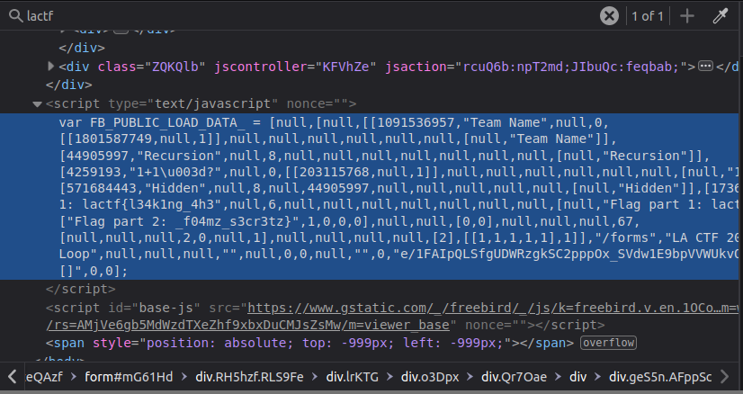

# Category: Misc

## Infinite Loop

This challenge links us to a google [form] (https://docs.google.com/forms/d/e/1FAIpQLSfgUDWRzgkSC2pppOx_SVdw1E9bpVVWUkvQssmWza11pufMUQ/viewform?usp=sf_link). If we fill out the form and keep clicking next, we never progress in the form. 

By inspecting the source of the form and searching for "lactf", we find the flag split in two and hidden in the source. By combining the pieces, we get lactf{l34k1ng_4h3_f04mz_s3cr3tz}. I will go into more detail about exactly where the flag was hidden in the next challenge.

## One by one

## gacha